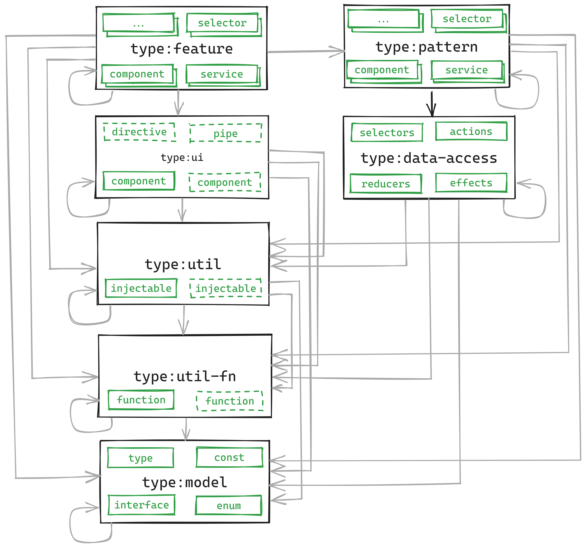
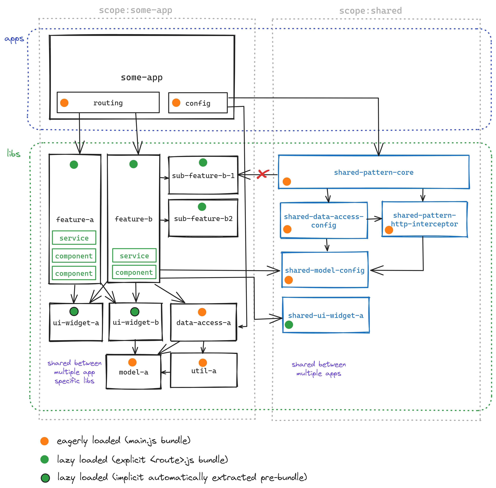

# Architecture

- **Applications** are just minimal wrappers around libraries which pull together combination of application specific and shared libraries.
- **Libraries** encapsulate all the business logic and are the only place where you should be writing your code.

## Why libraries instead of "a library" ?

Using multiple libraries with predefined types and clear scopes has several advantages over a single large library
which is shared across multiple applications in a single NX workspace:

- improved long term maintainability and extensibility
- enforce clean one way dependency graph (single large lib / app tend to have unstructured internal dependencies)
- enforce separation of concerns with clear-cut roles and responsibilities with pre-defined library types
- support both "pre-packaged" (eg "core" lib) and "à la carte" (app consumes collection of lips providing basic functionality based on its unique needs) approach to library consumption from consumer applications
- visualise dependency graph

## Library types

The architecture comes with a finite set of predefined library types which
allow for clean extendable architecture while preserving enough flexibility to implement
any specific use case. Following list represents a concise summary of each library type:
(check out the [extended version](../libs/tooling/nx-plugin/README.md))

- **feature** - lazy loaded feature (most custom logic will go here, eg components, services, ...)
- **pattern** - reusable pattern (eg layout, form, ...) (eager feature)
- **data-access** - headless NgRx based data access layer
- **event** - events dispatched by features / patterns (and consumed by data-access)
- **ui** - reusable UI component (eg button, input, ...)
- **util** - reusable Angular injectable utility
- **util-fn** - reusable TypeScript function utility (no Angular)
- **model** - reusable TypeScript types, interfaces, enums, consts



### Generating of additional components, services, pipes in the libraries

Based on the above described architecture, it will only make sense to generate additional
components, services, pipes, ... in the `feature` and `pattern` libraries to implement
specific use cases.

Besides that, it can make sense to generate also

- **data-access** - additional services ...
- **ui** - additional components, directives, pipes, (usually low amount, should be tightly coupled, eg `tab-group`, `tab-header`, `tab-content`), Asle it is better to generate separate `ui` library~

In general, it is the best to use NX plugin for Intellij IDEs to generate new components, services, ... in
the desired library.

- bind the **NX Generate (UI)** to a keyboard shortcut (eg `Ctrl + Alt + Shift + S`, or anything else)
- select a folder within the desired library, eg `libs/shared/ui/tabs/src/lib`
- hit the keyboard shortcut and select `@nx/angular:component` (service, or other...)
- provide the name (the `project` field should be filled automatically because we selected folder)
- run generator

## Architecture overview



This diagrams showcases an example of a single application which consumes multiple libraries

- libraries that are scoped to the application
- libraries that are shared across multiple applications

Please notice the concept of lazy loading, in general anything which was referenced by
an eagerly loaded part of the application will be eagerly loaded as well (even if it is consumed also by a lazy feature).

This is in practice:

- things referenced by the `app.config.ts` - core state and functionality
- things referenced by the `app.component.ts` - layout, navigation, ...

Everything else should be only referenced by the lazy loaded features.

> If a library is referenced by more than one lazy loaded feature, the bundler might
> decide to extract lazy loaded "pre-bundle" which will be loaded if any of the
> lazy loaded features is loaded. This is not a problem and represents additional optimisation
> performed transparently by the bundler.

## Implicit dependencies

Some libraries like `styles` and `assets` represent implicit dependencies as they are not
referenced directly using TypeScript imports. This means that they need a little bit of
extra setup in consumer applications for them to work properly.

### Assets

Asset libraries (images, translations, ...) have to be added in the consumer application's `project.json` file in the `targest.build.assets` array, for example...

```json
{
  "glob": "**/*",
  "input": "libs/shared/assets/i18n/src",
  "output": "assets/i18n"
},
{
  "glob": "**/*",
  "input": "libs/shared/assets/images/src",
  "output": "assets/images"
}
```

This entry will copy files from `libs/shared/assets/i18n/src` to `dist/apps/<consumer-app>/assets/i18n` folder and
from `libs/shared/assets/images/src` to `dist/apps/<consumer-app>/assets/images` folder.
We should also alwaysmake sure that such assets library is added as an implicit dependency in the `project.json` file of the consumer app in the
`implicitDependencies` array, for example...

```json
{
  "implicitDependencies": ["libs/shared/assets/i18n", "libs/shared/assets/images"]
}
```

> These libraries are added automatically if the app is generayed with `npm rung:app` but
> the existing apps (and generator) might need to be updated manually if more assets libraries
> are added.

That way, the consumer app will re-build if there was any change in the asset library.

### Styles

Sass styles libraries have to be added to the consumer application's `project.json` file
in the `targest.build.stylePreprocessorOptions.includePaths` array, for example...

```json
{
  "includePaths": ["libs/shared/styles/theme/src", "libs/shared/styles/components/src"]
}
```

Which will then allow importing of the files in the library `src/` folder in the consumer
`*.scss` files like global `styles.scss` or components `*.component.scss` files.

```scss
@import 'theme';

h1 {
  color: $dv-theme-primary-color;
}
```

We should also always add such styles library as an implicit dependency in the `project.json` file of the consumer app in the
`implicitDependencies` array, for example...

```json
{
  "implicitDependencies": ["libs/shared/styles/theme", "libs/shared/styles/components"]
}
```

That way, the consumer app will re-build if there was any change in the asset library.

## Project naming

NX out of the box uses path in a library name so a library generated in
`libs/shared/pattern/core` will have name `shared-pattern-core`.
This will be important when referencing projects when required as parameters for CLI commands like generators
with `--project shared-pattern-core` and executors like `nx test shared-pattern-core`.

## Moving and removing of libraries

Sometimes it will make a sense to move (or rename) a library or remove it completely.
For that we should always use the `nx` commands instead of just moving or removing the library folder as
that will automate most of the adjustments that need to be performed in order for the workspace to work properly.

- `nx g remove --project <project-name>` - will remove the project and its alias from root `tsconfig.json` file
- `nx g move --project <project-name> --destination <scope>/<type>/<new-name>` - will move the project and adjust its alias from root `tsconfig.json` file

After that we should always run `npm run validate -- --fix` and perform any manual adjustments as listed in the output.
